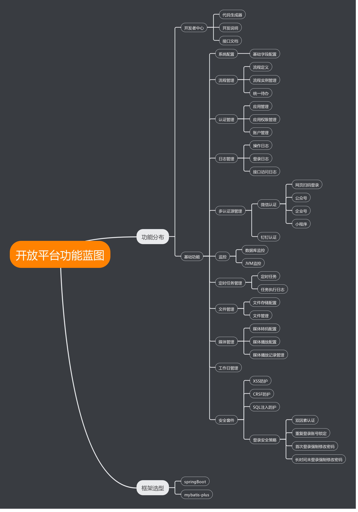

## easy4j

> easy4j是基于springBoot的一个java框架，旨在提供一个开箱即用的java开发框架。框架只提供基础技术组件的实现，不包含任务业务功能。

### 功能蓝图

### 架构选型

- 后端框架
    - springBoot 2.1.6
    - [mybatis-plus 3.3.1](http://mybatis.plus)

### 模块说明

- easy4j-core 框架基础
- easy4j-security
    - easy4j-security-oauth2 oauth2认证
- easy4j-modules
    - easy4j-modules-authentication 认证模块，包括：应用管理、应用权限管理、账户管理、多认证源
    - easy4j-modules-file 文件模块
    - easy4j-modules-process 流程模块
    - easy4j-modules-schedule 定时任务模块
    - easy4j-modules-media 媒体管理模块
    - easy4j-modules-workday 工作日
- easy4j-plugins
    - easy4j-plugins-security 安全套件
    - easy4j-plugins-monitor 监控套件
- easy4j-boot-starter